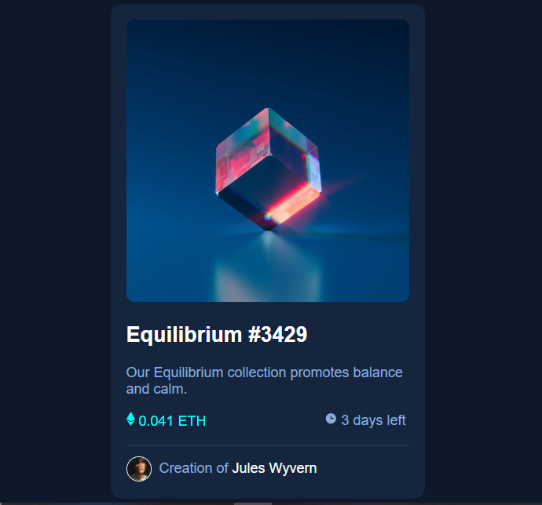

This is a solution to the [NFT preview card component challenge on Frontend Mentor](https://www.frontendmentor.io/challenges/nft-preview-card-component-SbdUL_w0U). Frontend Mentor challenges help you improve your coding skills by building realistic projects. 

## Table of contents

- [Overview](#overview)
  - [The challenge](#the-challenge)
  - [Screenshot](#screenshot)
  - [Links](#links)
- [My process](#my-process)
  - [Built with](#built-with)
- [Author](#author)

## Overview

### The challenge

Users should be able to:

- View the optimal layout depending on their device's screen size
- See hover states for interactive elements

### Screenshot

### Links

- Solution URL: (https://www.frontendmentor.io/solutions/responsive-page-using-basic-css-7hOvcrEETY)
- Live Site URL: (https://inioluwa2003.github.io/Frontend-mentor-NFT-preview-card/)

## My process

### Built with

- Semantic HTML5 markup
- CSS custom properties

## Author

- Frontend Mentor - [@Inioluwa2003](https://www.frontendmentor.io/profile/Inioluwa2003)
- Twitter - [@ini_adeyemo](https://www.twitter.com/ini_adeyemo)
- LinkedIn- [Adeyemo Inioluwa](https://www.linkedin.com/mwlite/in/adeyemo-inioluwa-497299246)
